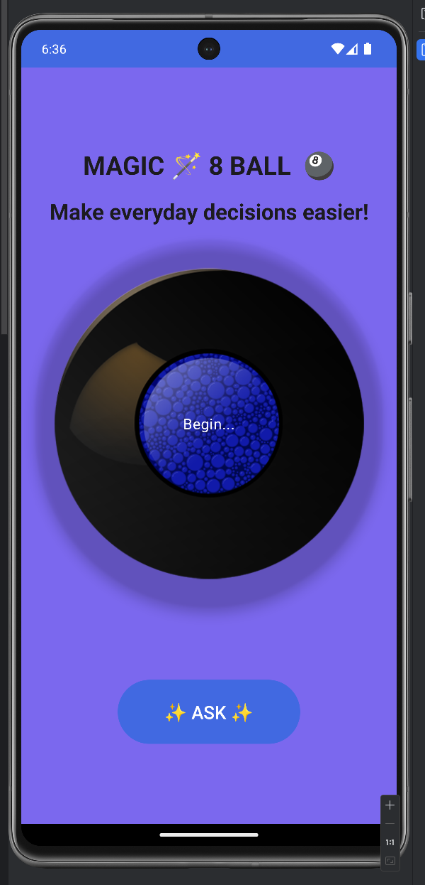
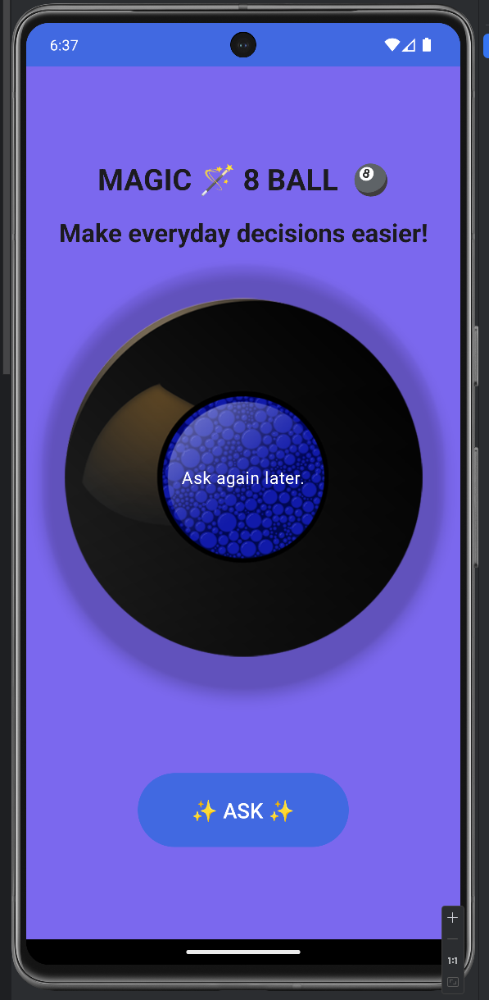

# Magic8ball-kotlin 🎱

Android Magic 8 Ball game using Kotlin with Jetpack Compose. 

<p align="center">
   
  
</p>


## About the App

Magic8ball-kotlin is a fun Android application that recreates the classic Magic 8 Ball experience. Users can ask a yes-or-no question, (tap a button), and receive a random response from the Magic 8 Ball. 
<p align="center">
  
  
</p>

</br>
</br>

| Features  ✨                                        |
| ---------------------------------------------------- |
| - **Built with Kotlin and Jetpack Compose:** The app is built entirely in Kotlin using Jetpack Compose for a modern and intuitive user interface. |
| - **Tap to Receive Answers:** Users can tap to receive a random answer from the Magic 8 Ball. |
| - **Smooth Animations:** Enjoy smooth animations and transitions powered by Jetpack Compose. |
| - **Customization:** Customize the appearance of the Magic 8 Ball with different themes and colors. |

</br>

## LinkedIn 😎

Connect with me on LinkedIn to stay updated on this project and more!

<p align="center">
  <a href="https://www.linkedin.com/in/ailyn-diaz-802943225">
    
  </a>
</p>

<p align="center">
  
</p>


  
## How to Use 🚀

1. Clone the repository to your local machine.
   ### Cloning the Repository

To clone the Magic8ball-kotlin repository to your local machine, you can use the following Git command:

```bash
git clone https://github.com/ailynux/Magic8ball-kotlin.git
```
2. Open the project in Android Studio.
3. Run the app on an Android emulator or physical device.
4. Ask your burning questions and let the Magic 8 Ball reveal the answers!

## Contributing 🤝

Contributions are welcome! If you'd like to contribute to this project, feel free to fork the repository and submit a pull request with your changes.


# Contact Me 🎉

If you have any questions or suggestions, feel free to reach out to me at:

📧 [adiaz@ai-lyn.com](mailto:adiaz@ai-lyn.com)

<p align="center">
  
  
  
  
  
  

</p>

